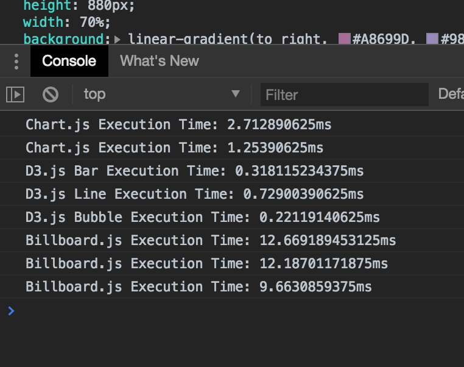

</img>
</img>
</img>
</img>
</img>

 #### Written By Lee Sun Hong, KOOKMIN UNIV. SW major junior

# Data Visualization.
> Chart.js, D3.js, Google Chart, Billboard.js, .... etc.

## 🔑 Table of Contents
* [About Data visualization.]()
* [Factors to consider when selecting a Web framework.]()
* [Introducing various frameworks.]()
    * [D3.js.]()
    * [Chart.js.]()
    * [Billboard.js.]()
    * [Google Chart.]()
* [Performance of frameworks.]()

## 🎯 About Data visualization.
**Data visualization** has become a very important part of the IT world today. 
The huge amount of data being generated by different web technologies need to be properly refined and visualized for the world to analysis. The advantages of analyzed data leads to taking well-informed decisions. As a front-end web developer, it is a great skill set to be able to visualize data as much as you can make beautiful interactive web pages. **Web technology** is a great skill set to be able to visualize data as much as you can make beautiful interactive web pages. For web-based applications, those libraries are almost always **Javascript**. We have a variety of Javascript libraries to choose from such as D3.js, Chart.js, and Google Charts. However, there can be an overwhelming number of choices with pros and cons for each library. 

- - -

## 🎪 Factors to consider when selecting a Web framework.

**1. Is it easy to customize charts to suit user needs?**
>Some libraries support animations while others do not, and quality of animation vary. Although if you chose to use animation, be sure to add in moderation, as it can be very distracting.The most important aspect regarding visuals is probably customization, i.e. how much you have control over the style so that you can fit the theme and styles of your application.

**2.How does the speed of execution compare to other frameworks?**
>If you plan to update large data sets at one time, then performance will matter. The libraries that are designed for large data sets usually will call out the performance as their main features.

**2.How many chart types does the framework provide?**
>There are some charting libraries that only focus on one or two types of charts, such as Bar or directional graphs, but most libraries trying to be comprehensive in the set of graphs it has. If one library doesn’t have all the chart types your need, it doesn’t hurt to use two or three charting libraries, but you do probably want to make them visually style consistent if they will be part of the same application.

- - -

## 🧚 Introducing various libraries.

## 1. D3.

D3.js is the standard for data visualization in Javascript, it often is the foundation for other libraries. It has a reputation for steep learning curve, also unlike many other JavaScript libraries, D3.js doesn’t ship with any pre-built charts out of the box. However, you can look at the list of graphs built with D3.js to get an overview. But there is a vast community of users who support each other and answer questions.

**Pros and Cons.**

Pros 1. Large community.
>D3.js is an active and very popular tool, so you can get answers quickly from a wealth of learning resources and communities.

Pros 2. A large number of examples.
>As many people use it, various examples are being used online.

Pros 3. Extremely flexible utilization.
>At first, it can be tricky, but because of the variety of technologies available, it is easy to create complex visualizations with data manipulation and binding.

Cons 1. Difficulty.
>Due to the complexity and flexibility of D3.js, users take a long time to learn.

Cons 2. Changes of grammar according to version up.
>v3, v4, v5 There are some grammatical changes that vary slightly depending on the step-by-step version upgrade.

## 2. Chart.js

Chart.js is one of most popular. There are only 8 chart types, but they are very easy to work with. Visually, it looks very pretty with a minimalistic and flat look, right out of the box. The default animation is very well done. It is also responsive. It has a very large community, so there are a lot of examples.

**Pros and Cons.**

Pros 1. Lightweight library weight.
>Due to its light weight, loading time and other effects are small.
    

Pros 2. Simplified writing.
>Well-organized grammar and concise grammar to take advantage of him.
    

Cons 1. Limitations of visualization.
>Only certain types of graphs can be created, which limits the creation of various visualization elements.
    

Cons 2. Canvas limitations.
>Based on the canvas, the chart is broken and not clean.
    
## 3. billboard.js

Billboard .js was created by NAVER Engineer to solve the inconveniences of using C3.js. Users can create charts quickly and easily through a simple interface, and have a variety of options to enable detailed UI customization.

**Pros and Cons.**

Pros 1. A clear example explanation.
>On the page that introduces billboard.js, I have provided various examples of use of this library neatly. I think this is the biggest advantage.
    

Pros 2. Simplified writing.
>Taking the advantages of chart.js as it is, well-organized grammar and concise grammar for utilizing it.
    

Cons 1. Small community.
>It is difficult to communicate vigorously with users because the part that is still used is small.
    

Cons 2. Weight.
>It is not as light as Chart.js because it is based on D3.

## 4. Google Chart.

Google Charts is an open source chart library which is powerful and very simple to use. Google Charts provides a wide range of charts, for almost any kind of data visualization need. It has a rich chart gallery that include options like pie charts, bar charts, Scatter Charts, donut charts, etc. Moreover, various customization options are available with the charts. Visually, it doesn’t have that clean and minimalistic look right out of box compared to Chartjs. But you can customize it. 

## 💿 Performance of libraries.

</img>

The graphs of chart.js and billboard.js were created by generating one calculation result and nine random results according to the calculation results.

Chart.js Execution Time: 5.109130859375ms (10 charts.js bar graphs) Chart.js Execution Time: 2.545654296875ms (10 charts.js line graphs) D3.js Bar Execution Time: 0.333251953125ms (d3.js bar D3.js Line Execution Time: 0.597900390625ms (one d3.js line graph) D3.js Bubble Execution Time: 0.19091796875ms (one d3.js bubble graph) Billboard.js Execution Time: 13.80419921875 ms (billboard.js bar graph 10) Billboard.js Execution Time: 15.85107421875ms (billboard.js line graph 10) Billboard.js Execution Time: 20.041015625ms (billboard.js bubble graph 10)

The billboard.js, based on D3, was clearly slower.

    
   
